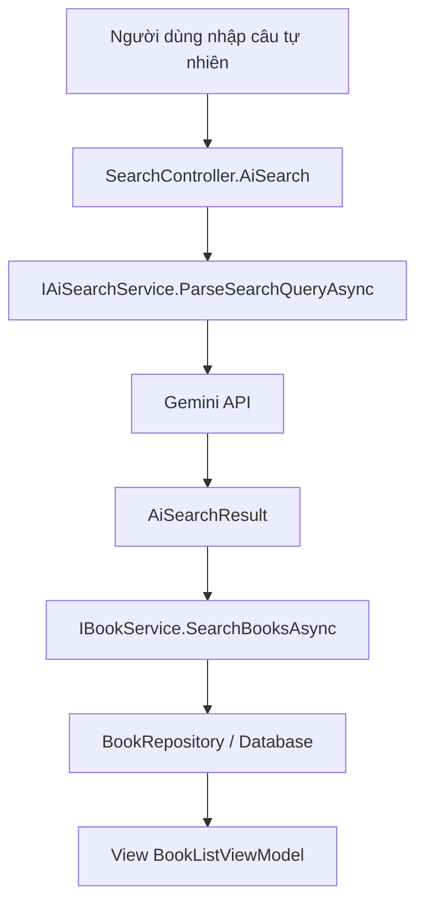

# Giải thích phần tích hợp AI trong dự án Quản lý thư viện

## 1. AI được tích hợp ở đâu trong project

Phần tích hợp AI của hệ thống nằm chủ yếu ở các file sau:

- [Backend/Client/Controllers/SearchController.cs](Backend/Client/Controllers/SearchController.cs)
- [Backend/Core.Shared/Services/AiSearchService.cs](Backend/Core.Shared/Services/AiSearchService.cs)
- [Backend/Core.Shared/Interfaces/IAiSearchService.cs](Backend/Core.Shared/Interfaces/IAiSearchService.cs)
- [Backend/Client/Program.cs](Backend/Client/Program.cs)
- `Backend/Client/appsettings.json` hoặc `appsettings.Development.json` để cấu hình `OpenAI:ApiKey`

Nếu nhìn theo chức năng, thì:

- `SearchController` là nơi nhận request từ người dùng.
- `AiSearchService` là nơi gọi Gemini API và phân tích câu tìm kiếm.
- `IAiSearchService` là hợp đồng để controller phụ thuộc vào interface, không phụ thuộc trực tiếp vào class cài đặt.
- `Program.cs` là nơi đăng ký DI cho service AI.

---

## 2. Mục tiêu của phần AI

AI trong project này không phải để tự sinh nội dung hay trả lời chat tổng quát. Nó được dùng đúng một mục đích rất cụ thể:

- Nhận câu tìm kiếm tự nhiên của người dùng.
- Phân tích câu đó thành `keyword` ngắn gọn hơn.
- Từ `keyword` đó, hệ thống tìm sách trong database theo luồng tìm kiếm hiện có.

Nói cách khác, AI ở đây là lớp **diễn giải truy vấn**, không phải lớp **ra quyết định nghiệp vụ chính**.

Hiện tại hệ thống đã chuyển từ Gemini sang **OpenAI ChatGPT** để thực hiện bước phân tích truy vấn này.

---

## 3. Luồng hoạt động tổng thể của AI

Luồng hoạt động của AI trong Client là:

```text
Người dùng nhập câu tự nhiên
	-> SearchController.AiSearch()
	-> IAiSearchService.ParseSearchQueryAsync()
-> AiSearchService gọi OpenAI ChatGPT API
-> OpenAI trả JSON keyword + interpretedQuery
	-> SearchController dùng keyword gọi IBookService.SearchBooksAsync()
	-> BookService tìm sách trong database
	-> View hiển thị kết quả
```

### Ví dụ

Người dùng nhập:

```text
tôi muốn tìm sách lập trình Python cho người mới bắt đầu
```

AI sẽ cố gắng chuyển thành:

- `Keyword`: `Python lập trình`
- `InterpretedQuery`: `Sách lập trình Python cho người mới bắt đầu`

Sau đó hệ thống không tìm nguyên câu dài nữa, mà dùng keyword đã được làm sạch để tìm sách hiệu quả hơn.

---

## 4. Luồng nghiệp vụ của phần AI

### 4.1 Người dùng gửi câu tìm kiếm

Người dùng nhập câu tự nhiên vào form tìm kiếm nâng cao trên trang Client.

Controller nhận dữ liệu qua action:

- `SearchController.AiSearch(string aiQuery)`

### 4.2 Controller gọi AI service

Trong action này, controller gọi:

```csharp
var aiResult = await _aiSearchService.ParseSearchQueryAsync(aiQuery);
```

Lúc này trách nhiệm của controller chỉ là điều phối, không tự gọi HTTP request đến Gemini.

### 4.3 AI service gọi OpenAI ChatGPT

`AiSearchService` nhận câu đầu vào, rồi:

1. Kiểm tra chuỗi nhập có rỗng không.
2. Lấy `OpenAI:ApiKey` và `OpenAI:Model` từ cấu hình.
3. Tạo prompt yêu cầu ChatGPT trả về JSON chuẩn.
4. Gửi request đến OpenAI Chat Completions API.
5. Đọc phản hồi trả về.
6. Parse JSON thành đối tượng `AiSearchResult`.

### 4.4 Controller dùng keyword để tìm sách

Sau khi có kết quả AI, controller lấy `aiResult.Keyword` và gọi lại luồng tìm kiếm hiện có:

```csharp
var books = await _bookService.SearchBooksAsync(aiResult.Keyword);
```

Tức là AI không tự tìm sách. AI chỉ tạo keyword tối ưu hơn để `BookService` xử lý.

### 4.5 Trả kết quả về giao diện

Controller tạo `BookListViewModel` rồi truyền về view `Index`.

Trong view có thể hiển thị thêm:

- câu gốc người dùng nhập
- keyword mà AI trích ra
- câu diễn giải ý định tìm kiếm
- trạng thái AI có thành công hay không

---

## 5. AiSearchService hoạt động như thế nào

File chính của AI là [Backend/Core.Shared/Services/AiSearchService.cs](Backend/Core.Shared/Services/AiSearchService.cs).

### 5.1 Input đầu vào

Service nhận một chuỗi tự nhiên:

- ví dụ: `sách của Nguyễn Nhật Ánh`
- ví dụ: `sách học Python cho người mới`

### 5.2 Prompt gửi cho OpenAI ChatGPT

Service xây dựng prompt yêu cầu ChatGPT trả về đúng JSON, gồm 2 trường:

- `keyword`
- `interpretedQuery`

Điều này rất quan trọng vì hệ thống phía sau chỉ cần keyword ngắn để tìm kiếm, không cần câu phân tích dài dòng.

### 5.3 Cấu hình API key

`AiSearchService` đọc key từ:

```text
OpenAI:ApiKey
```

Có thể cấu hình thêm model qua:

```text
OpenAI:Model
```

Nếu key chưa cấu hình thì service không lỗi cứng, mà chuyển sang chế độ fallback để hệ thống vẫn chạy.

### 5.4 Parse response

Gemini trả về dữ liệu JSON lồng nhau. Service sẽ:

- lấy text từ response
- loại bỏ markdown fence nếu có
- parse JSON nội bộ
- gán vào `AiSearchResult`

### 5.5 Fallback khi lỗi

Nếu có lỗi mạng, timeout, JSON lỗi hoặc chưa có key, service trả về fallback.

Fallback nghĩa là:

- `Keyword` sẽ lấy chính câu người dùng nhập
- `InterpretedQuery` cũng dùng câu gốc
- `IsSuccess` có thể là `false`

Nhờ vậy UI không bị vỡ, và hệ thống vẫn có thể dùng tìm kiếm thường thay thế.

---

## 6. IAiSearchService dùng để làm gì

File [Backend/Core.Shared/Interfaces/IAiSearchService.cs](Backend/Core.Shared/Interfaces/IAiSearchService.cs) định nghĩa hợp đồng cho phần AI.

Nó gồm:

- `ParseSearchQueryAsync(string naturalLanguageQuery)`

Đi kèm là model kết quả:

- `AiSearchResult`

Model này chứa 4 trường:

- `Keyword`
- `InterpretedQuery`
- `IsSuccess`
- `ErrorMessage`

Ý nghĩa của interface này là để controller chỉ cần biết “có một service phân tích câu tìm kiếm”, còn việc bên trong gọi Gemini ra sao thì do class triển khai lo.

---

## 7. SearchController sử dụng AI như thế nào

File [Backend/Client/Controllers/SearchController.cs](Backend/Client/Controllers/SearchController.cs) là điểm vào của tính năng AI từ phía người dùng.

Controller này có 2 đường tìm kiếm:

- tìm kiếm thường qua action `Index`
- tìm kiếm bằng AI qua action `AiSearch`

### Tìm kiếm thường

Người dùng nhập keyword hoặc lọc danh mục, controller gọi trực tiếp `IBookService`.

### Tìm kiếm AI

Người dùng nhập câu tự nhiên, controller:

1. gọi `ParseSearchQueryAsync`
2. lấy `Keyword` từ kết quả
3. gọi `SearchBooksAsync`
4. trả kết quả ra view

Nghĩa là AI chỉ được chèn vào trước bước tìm kiếm sách, không thay thế toàn bộ logic của hệ thống.

---

## 8. Program.cs đăng ký AI như thế nào

File [Backend/Client/Program.cs](Backend/Client/Program.cs) là nơi đăng ký dependency injection cho AI.

Nó có các dòng quan trọng:

- `AddHttpClient<AiSearchService>()`
- `AddScoped<IAiSearchService, AiSearchService>()`

Điều này cho phép:

- `HttpClient` được inject đúng chuẩn
- controller nhận `IAiSearchService` qua constructor
- hệ thống tuân theo DI thay vì tự new object thủ công

Nếu không có phần này thì `SearchController` sẽ không lấy được AI service.

---

## 9. Luồng dữ liệu từ AI đến danh sách sách



Luồng này cho thấy AI không đứng riêng lẻ, mà chỉ là bước trung gian giúp chuẩn hóa câu hỏi trước khi tìm trong database.

---

## 10. Tác động nghiệp vụ của AI lên hệ thống

Phần AI tạo ra 3 tác động rõ ràng:

### 10.1 Tăng khả năng tìm kiếm theo ngôn ngữ tự nhiên

Người dùng không cần nhập đúng keyword kỹ thuật. Họ có thể gõ theo cách nói bình thường.

### 10.2 Giảm phụ thuộc vào chuỗi tìm kiếm thô

Nếu chỉ dùng `Contains`, kết quả thường kém chính xác. AI giúp tách ý định tìm kiếm ra ngắn gọn hơn.

### 10.3 Không làm gãy hệ thống khi AI lỗi

Do có fallback, nếu Gemini không phản hồi thì hệ thống vẫn chạy bằng tìm kiếm thường.

---

## 11. Kết luận

Tích hợp AI trong project này nằm chủ yếu ở:

- [Backend/Client/Controllers/SearchController.cs](Backend/Client/Controllers/SearchController.cs)
- [Backend/Core.Shared/Services/AiSearchService.cs](Backend/Core.Shared/Services/AiSearchService.cs)
- [Backend/Core.Shared/Interfaces/IAiSearchService.cs](Backend/Core.Shared/Interfaces/IAiSearchService.cs)
- [Backend/Client/Program.cs](Backend/Client/Program.cs)

Luồng AI rất rõ ràng:

1. Người dùng nhập câu tự nhiên.
2. Controller chuyển câu đó cho AI service.
3. AI service gọi Gemini và trích keyword.
4. Controller dùng keyword để gọi luồng tìm sách hiện có.
5. View hiển thị kết quả.

Nói ngắn gọn, AI trong hệ thống này là lớp **hỗ trợ tìm kiếm thông minh**, không phải lớp thay thế nghiệp vụ chính của thư viện.
