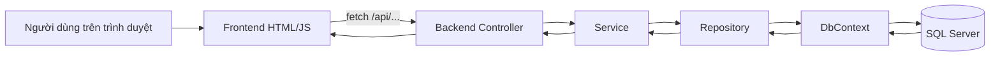

# Giải thích chỗ connect backend và frontend trong dự án

Tài liệu này chỉ ra các file đang nối backend với frontend, và mô tả cách hai bên giao tiếp với nhau trong project quản lý thư viện.

## 1. Backend và frontend nối với nhau ở đâu

Phần kết nối không nằm ở một file duy nhất mà trải ra ở nhiều chỗ:

- [Backend/Admin/Program.cs](Backend/Admin/Program.cs)
- [Backend/Client/Program.cs](Backend/Client/Program.cs)
- [Backend/Admin/Controllers](Backend/Admin/Controllers)
- [Backend/Client/Controllers](Backend/Client/Controllers)
- [Fontend/Admin/app.js](Fontend/Admin/app.js)
- [Fontend/Client/app.js](Fontend/Client/app.js)
- [Fontend/Acount/index.html](Fontend/Acount/index.html)
- [Fontend/Acount/sign-up.html](Fontend/Acount/sign-up.html)

Nếu nhìn theo vai trò, thì:

- `Program.cs` ở backend dùng để đăng ký service, route, session và map frontend tĩnh.
- Controller ở backend cung cấp dữ liệu hoặc API cho frontend.
- `app.js` và các file HTML ở frontend dùng `fetch()` để gọi ngược về backend.

---

## 2. Hai kiểu connect trong project

Trong dự án này có 2 kiểu kết nối backend - frontend:

### 2.1 Kiểu 1: Backend phục vụ frontend tĩnh

Backend cấu hình để đọc và phục vụ các file HTML, CSS, JS trong thư mục `Fontend`.

Ví dụ:

- `Backend/Admin/Program.cs` map thư mục `Fontend/Admin`.
- `Backend/Client/Program.cs` map thư mục `Fontend/Client`.

Nhờ vậy, khi mở app, trình duyệt có thể tải trực tiếp:

- `index.html`
- `app.js`
- `styles.css`

### 2.2 Kiểu 2: Frontend gọi backend bằng API

Frontend dùng JavaScript `fetch()` để gọi các endpoint backend như:

- `/api/auth/me`
- `/api/auth/login`
- `/api/auth/register`
- `/api/books/latest`
- `/api/books/trending`
- `/api/borrow/history`

Đây là luồng dữ liệu thật giữa giao diện và server.

---

## 3. Backend connect frontend bằng cách nào

### 3.1 File `Program.cs` của Admin

File [Backend/Admin/Program.cs](Backend/Admin/Program.cs) làm các việc chính sau:

- đăng ký `DbContext`
- đăng ký repository và service vào DI
- bật session
- map static file cho frontend Admin
- map thư mục ảnh upload như `book-images`, `reader-avatars`, `staff-avatars`
- đăng ký route controller

Đoạn quan trọng nhất là phần này:

- `app.UseDefaultFiles(...)`
- `app.UseStaticFiles(...)`
- `app.MapControllers()`
- `app.MapControllerRoute(...)`

Điều đó có nghĩa là backend vừa là web server cho HTML tĩnh, vừa là API server cho dữ liệu.

### 3.2 File `Program.cs` của Client

File [Backend/Client/Program.cs](Backend/Client/Program.cs) cũng làm tương tự:

- map thư mục `Fontend/Client`
- map thư mục `Fontend/Acount`
- serve ảnh sách và ảnh đại diện
- đăng ký `IAiSearchService`
- đăng ký `IBookService`, `IBorrowService`, `IReaderService`, `IUnifiedAuthService`
- bật session và route MVC

Client Program là nơi nối cả giao diện client lẫn API dữ liệu cho bạn đọc.

### 3.3 Phục vụ file ảnh và file giao diện

Backend không chỉ trả JSON, mà còn serve các file tĩnh:

- ảnh sách từ `/book-images`
- ảnh bạn đọc từ `/reader-avatars`
- ảnh nhân viên từ `/staff-avatars`

Nhờ đó frontend chỉ cần dùng đường dẫn URL là có thể hiển thị ảnh từ backend.

---

## 4. Frontend connect backend bằng cách nào

### 4.1 File `Fontend/Admin/app.js`

File [Fontend/Admin/app.js](Fontend/Admin/app.js) là lớp điều khiển giao diện admin.

Trong file này có khai báo:

```javascript
this.apiUrl = "/api";
```

Điều đó có nghĩa là toàn bộ request của frontend sẽ gọi về backend qua prefix `/api`.

Ví dụ frontend gọi:

- `/api/auth/me`
- `/api/Book/All`
- `/api/Reader/All`
- `/api/Category/All`
- `/api/Borrow/All`

Các dữ liệu này được render lên dashboard, danh sách sách, bạn đọc, danh mục, phiếu mượn, nhân viên.

### 4.2 File `Fontend/Client/app.js`

File [Fontend/Client/app.js](Fontend/Client/app.js) là lớp điều khiển giao diện bạn đọc.

Nó cũng dùng:

```javascript
this.apiUrl = "/api";
```

Frontend client gọi backend để lấy:

- sách mới nhất
- sách nổi bật
- sách đang xu hướng
- lịch sử mượn
- chi tiết phiếu mượn
- dữ liệu tài khoản đang đăng nhập

### 4.3 Các file HTML đăng nhập và đăng ký

Hai file:

- [Fontend/Acount/index.html](Fontend/Acount/index.html)
- [Fontend/Acount/sign-up.html](Fontend/Acount/sign-up.html)

chứa JavaScript gọi trực tiếp backend bằng `fetch()`.

Ví dụ:

- đăng nhập gọi `POST /api/auth/login`
- đăng ký gọi `POST /api/auth/register`

Đây là chỗ frontend gửi dữ liệu form lên backend để tạo session hoặc tạo tài khoản mới.

---

## 5. Luồng hoạt động backend - frontend

### 5.1 Luồng backend phục vụ trang

1. Trình duyệt mở một file HTML trong `Fontend`.
2. Backend qua `Program.cs` trả file tĩnh đó.
3. File HTML load tiếp `app.js` và `styles.css`.
4. `app.js` bắt đầu gọi API về backend.

### 5.2 Luồng frontend gọi dữ liệu

1. Người dùng thao tác trên giao diện.
2. JavaScript trong `app.js` gọi `fetch('/api/...')`.
3. Request đi vào controller backend.
4. Controller gọi service.
5. Service gọi repository và DbContext.
6. Dữ liệu trả về JSON.
7. Frontend nhận JSON và render ra HTML.

### 5.3 Luồng đăng nhập

1. User nhập email và mật khẩu.
2. Frontend gọi `POST /api/auth/login`.
3. Backend kiểm tra tài khoản.
4. Nếu hợp lệ, backend trả JSON user.
5. Frontend dùng kết quả để chuyển sang trang phù hợp.

### 5.4 Luồng đăng ký

1. Người dùng nhập thông tin ở form sign-up.
2. Frontend tạo `FormData` và gửi `POST /api/auth/register`.
3. Backend nhận dữ liệu, lưu bạn đọc mới.
4. Frontend hiển thị thông báo thành công hoặc lỗi.

---

## 6. Các controller làm cầu nối dữ liệu

Backend chỉ thực sự nối với frontend qua các controller có trả JSON hoặc xử lý request form.

Một số controller quan trọng:

- `AccountController`
- `BookController`
- `BorrowController`
- `CategoryController`
- `ReaderController`
- `StaffController`
- `HomeController`
- `SearchController`

Các controller này thường trả về:

- `Json(...)` cho API AJAX
- `View(...)` nếu là trang MVC
- `RedirectToAction(...)` nếu cần chuyển trang

Frontend chỉ cần biết endpoint, không cần biết service bên trong hoạt động thế nào.

---

## 7. Cách dữ liệu đi qua hệ thống



### Ví dụ với trang Admin

1. Mở `Fontend/Admin/index.html`.
2. `Fontend/Admin/app.js` gọi `/api/auth/me` để kiểm tra session.
3. Nếu đã đăng nhập, app.js gọi tiếp các API lấy sách, bạn đọc, danh mục, phiếu mượn.
4. Backend trả JSON.
5. JavaScript dựng dashboard và bảng dữ liệu.

### Ví dụ với trang Client

1. Mở `Fontend/Client/index.html`.
2. `Fontend/Client/app.js` gọi `/api/books/latest` và `/api/books/trending`.
3. Backend trả danh sách sách.
4. Frontend render trang chủ, grid sách, chi tiết và lịch sử mượn.

---

## 8. Điều quan trọng cần hiểu

- Backend không “nhìn” trực tiếp vào file HTML để lấy dữ liệu.
- Frontend không tự truy cập database.
- Hai bên chỉ nói chuyện qua HTTP request/response.
- `Program.cs` là nơi backend mở cổng cho frontend tĩnh và API.
- `fetch()` trong JS là nơi frontend gọi backend.

Nói đơn giản, backend là **người cung cấp dữ liệu và file tĩnh**, còn frontend là **người hiển thị và gửi yêu cầu**.

---

## 9. Kết luận

Trong project này, code connect backend và frontend nằm chủ yếu ở:

- [Backend/Admin/Program.cs](Backend/Admin/Program.cs)
- [Backend/Client/Program.cs](Backend/Client/Program.cs)
- [Backend/Admin/Controllers](Backend/Admin/Controllers)
- [Backend/Client/Controllers](Backend/Client/Controllers)
- [Fontend/Admin/app.js](Fontend/Admin/app.js)
- [Fontend/Client/app.js](Fontend/Client/app.js)
- [Fontend/Acount/index.html](Fontend/Acount/index.html)
- [Fontend/Acount/sign-up.html](Fontend/Acount/sign-up.html)

Luồng làm việc chuẩn là:

1. Backend phục vụ giao diện tĩnh và API.
2. Frontend dùng `fetch()` gọi API.
3. Controller nhận request và gọi service.
4. Service/Repository lấy dữ liệu từ database.
5. Backend trả kết quả cho frontend để render.

Đây là cách project kết nối hai lớp backend và frontend với nhau một cách rõ ràng và tách biệt.
